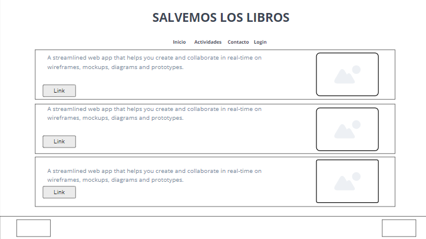
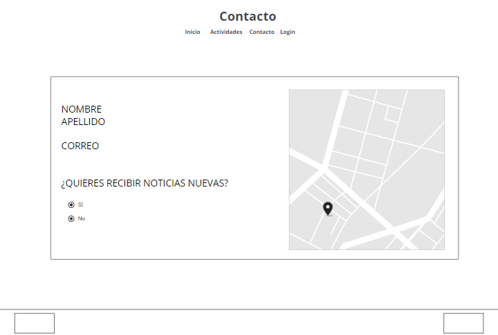
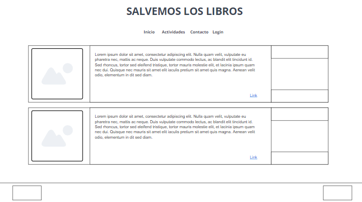
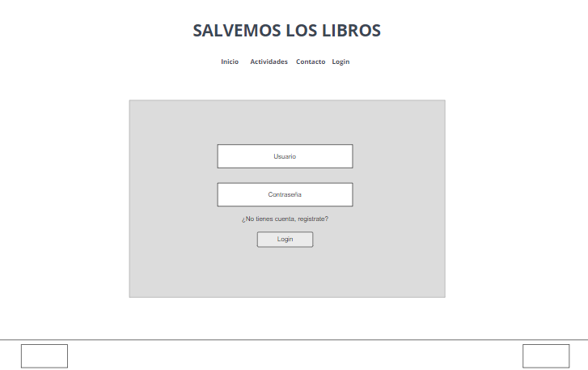

# iaw22-salvar-los-libros

La guía de estilos debe incluirse en el archivo README.md (haciendo uso de los estilos que este lenguaje nos ofrece) y debe incluir los siguientes apartados.

Explicar el contexto (enunciado de la actividad). Descripción de la propuesta de solución seleccionada.
Estilos: Sobre el colorido del fondo de la página y otras cuestiones, a vuestra elección.
Debes de seleccionar 2 tipos de letra. Uno para títulos y otro para fuente normal
Debes seleccionar una triada de colores. Establecer cuál va a ser el color principal, secundario y el de alerta.
Prototipos: Debes realizar mockups las 4 web que va a tener el proyecto.
Página principal con descripción de la solución propuesta para salvar los libros.
Página secundaria. Contendrá una tabla (rejilla) donde se muestran las actividades realizadas.
Página contacto, Formulario de contacto donde se visualiza un mapa.
Página de registro/login.

# SALVEMOS A LOS LIBROS

### ¿Como podemos salvar a los libros?

Se me ocurrió que podiamos salvar los libros de la antigua biblioteca haciendo esculturas/figuras de papel.

### FUENTES

1. PassionOne
2. PatrickHead

### COLORES 

Como color principal: #415996  
Como color secundario: #2C3C66  
Como color fondo: Blanco

.png)

### PROTOTIPOS
#### INICIO

#### CONTACTOS

#### ACTIVIDADES

#### LOGIN

